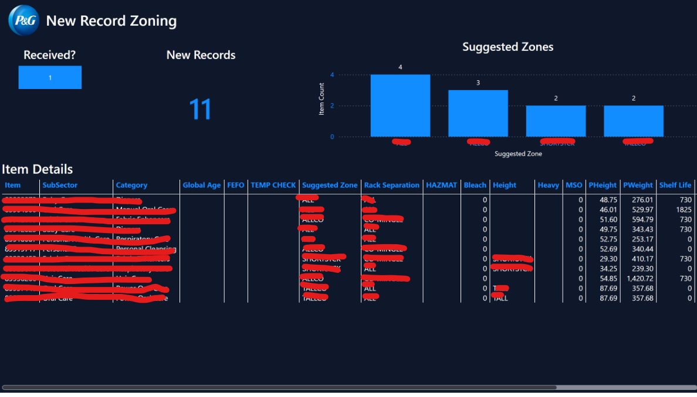

# Warehouse Zoning Automation

A Power BI and Power Automate pipeline built to eliminate a manual, macro-driven zoning process.

*Item-level detail (product names, subsectors, categories) has been redacted, as this dashboard runs on proprietary company data.*

## The Business Problem

Warehouse zoning had been managed through a legacy Access and Excel macro system, requiring manual upkeep every time zone data changed. That process was slow, error-prone, and dependent on someone running the macros correctly each time. The team needed an automated pipeline that could keep zoning data current without manual intervention.

## Methodology

Global Age Excel data feeds into a DirectQuery Power BI composite model, with Power Automate and Power Query handling the pipeline that moves and refreshes that data automatically. The composite model design lets the report combine this automated feed with other data sources without duplicating the manual refresh work the old system required.

## Skills

- **Power BI**: DirectQuery, composite data models
- **Power Automate**: automated data pipeline replacing manual macro triggers
- **Power Query**: data transformation and integration
- **Excel**: source data (Global Age file)

## Results

The automated pipeline replaces the legacy Access/Excel macro process entirely, removing the manual steps and the risk of a missed or incorrectly run macro.

*[Add specific impact metrics here if available, e.g. hours saved per week, error rate before and after, or how often the old process required manual fixes.]*
