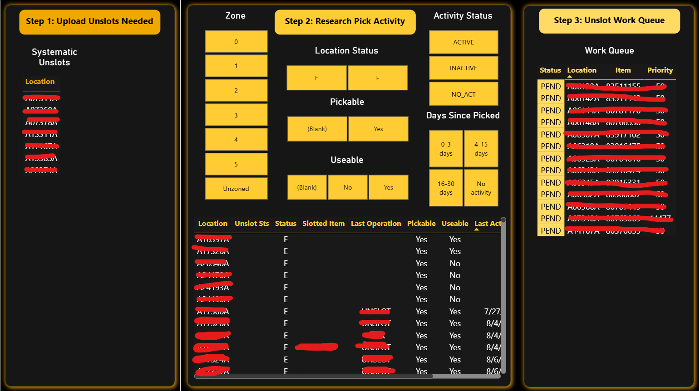

# Pick Face Productivity Dashboard

A SQL and Power BI reporting tool built to identify low-activity pick face locations so high-demand inventory could be cycled in.

*Location IDs and item numbers have been redacted, as this dashboard runs on proprietary company data.*

## The Business Problem

Pick face locations in the warehouse hold product for case-level picking, and slot space is limited. Without a way to measure how active each pick face location actually is, low-velocity SKUs can sit in prime pick face real estate while high-demand inventory waits to be slotted. Operations needed a repeatable way to gauge pick face activity and flag which locations should be cycled out in favor of higher-velocity product.

## Methodology

The core report (CP01) pulls inbound and outbound activity for each pick face location and combines them using SQL CTEs with UNION ALL, then buckets that combined activity into productivity tiers. Zone sourcing runs through a canonical view (`pbi_custom.wcfc_casepick_zones`), with PST time zone conversion applied so activity timestamps line up correctly across shifts. The zone-sourcing logic itself required handling several edge cases to keep location-to-zone mapping accurate.

That data feeds a three-step interactive tool built in Power BI:
1. **Upload Unslots Needed** — surfaces the current list of locations flagged for unslotting
2. **Research Pick Activity** — lets a user filter by zone, location status, pickable/useable flags, and days since last pick, to review and validate which locations actually belong on the unslot list
3. **Unslot Work Queue** — turns the validated list into a prioritized, actionable queue for the team executing the unslots

## Skills

- **SQL**: CTEs, UNION ALL for combining inbound and outbound activity, activity bucketing logic, time zone conversion
- **Power BI**: interactive filtering, multi-step workflow design, dashboard layer for surfacing and actioning low-activity locations

## Results

The tool gives operations a clear, repeatable, self-service way to identify underperforming pick face locations and turn that finding directly into a prioritized work queue, replacing manual, ad hoc activity checks with a standing process the team can run on their own.

*[Add specific impact metrics here if available, e.g. number of locations cycled, productivity lift, or time saved versus the prior manual process.]*
